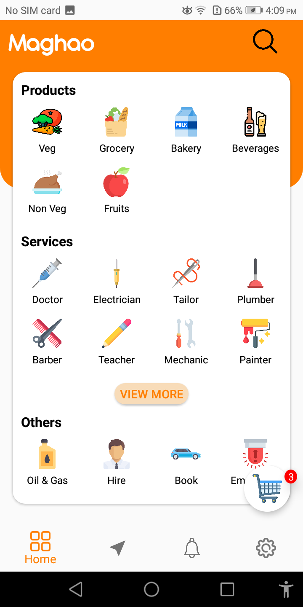
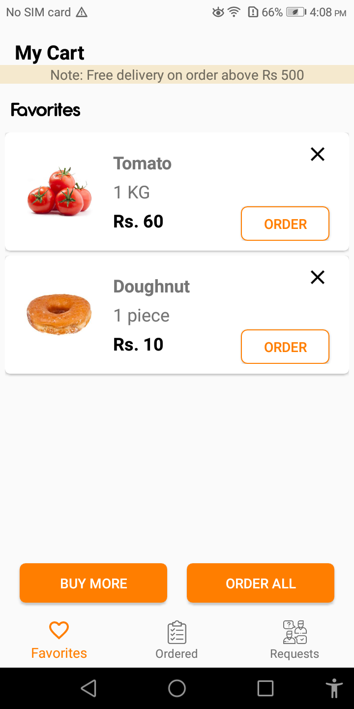
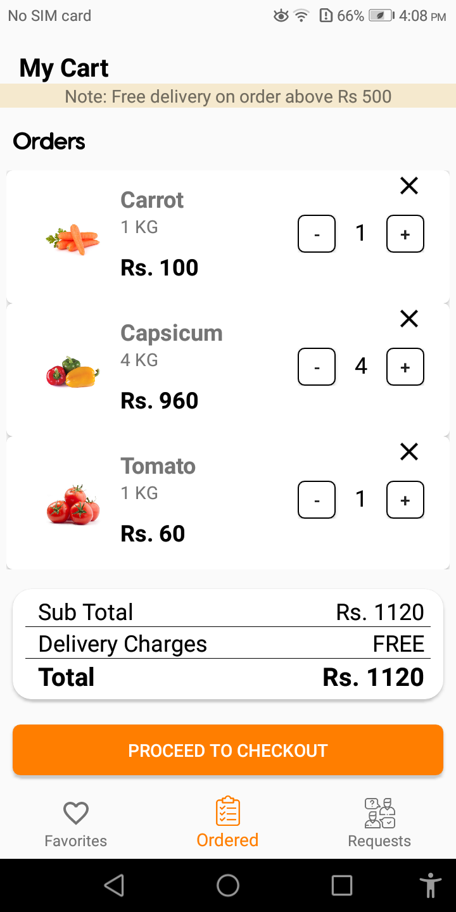
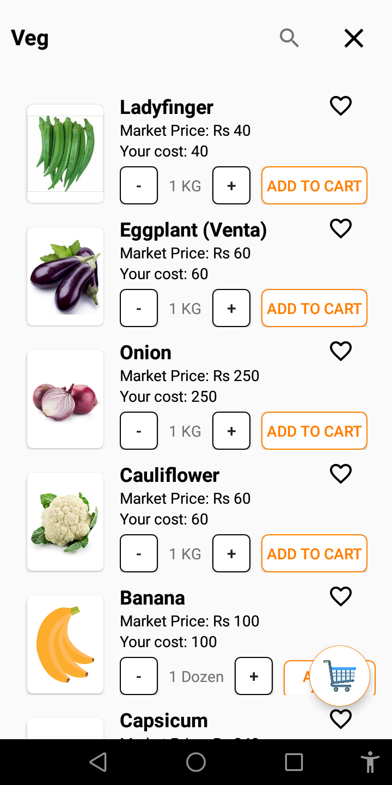
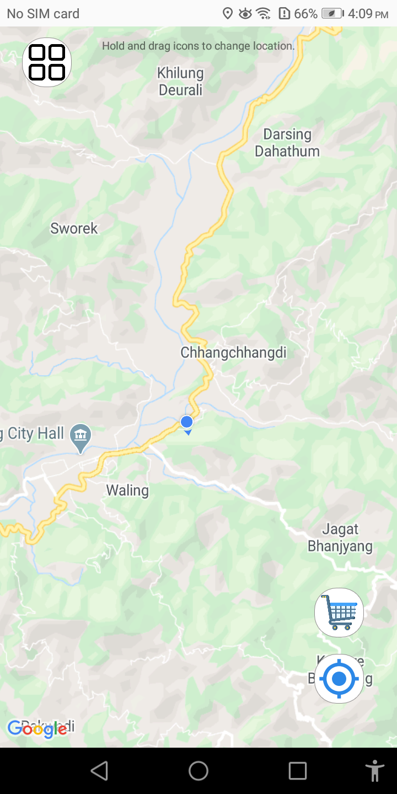
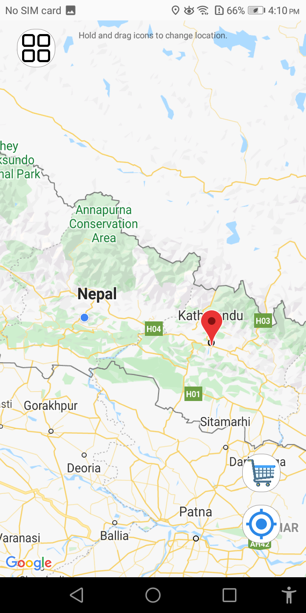

# maghao
android grocery shopping app with a lots of bugs you to fix.

## Features
1. Firebase Authentication (Phone Auth)
2. Google Maps API
3. SQLite CRUD
4. Firebase Realtime Database, Cloud Firestore and Storage
5. Lots of bugs.

### Screenshots

#### Home

#### My Cart Favs

#### My Cart Orders

#### Add to Cart

#### Maps

#### Settings

